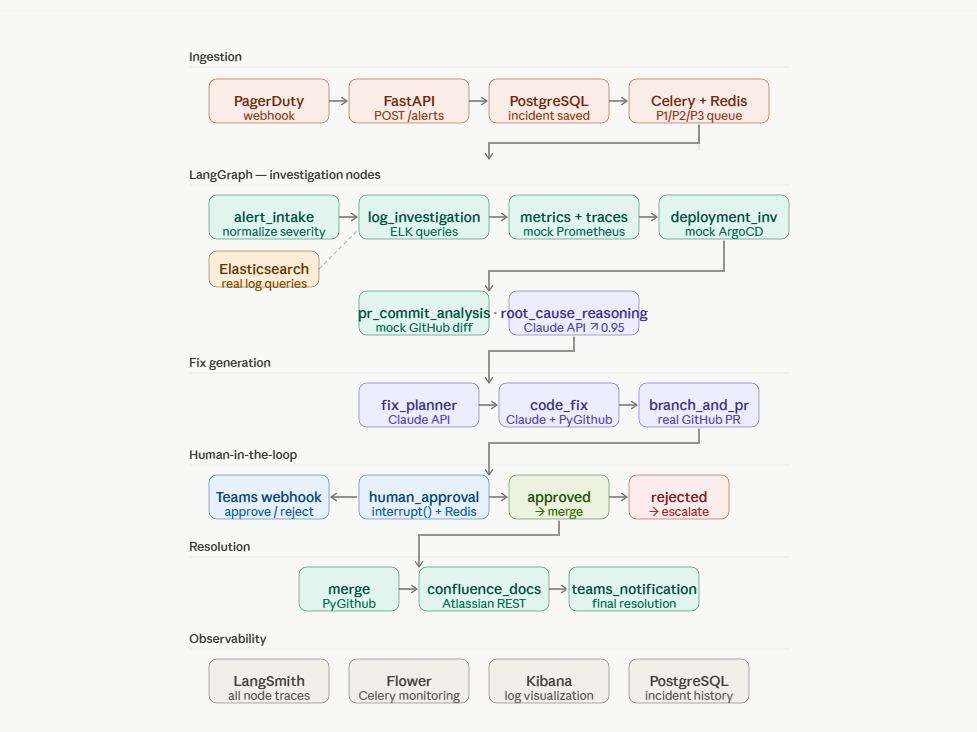
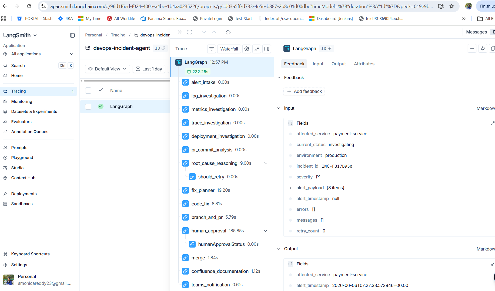
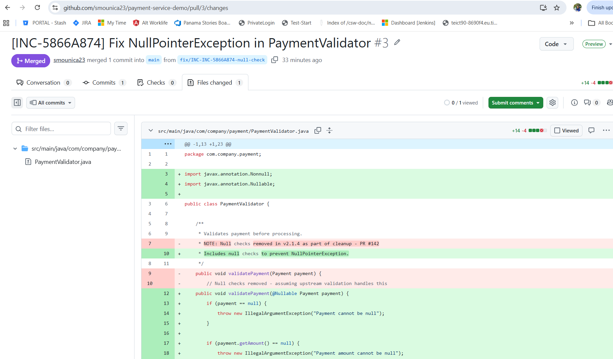
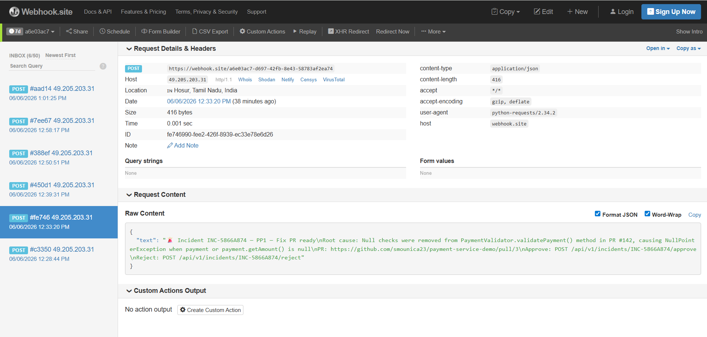
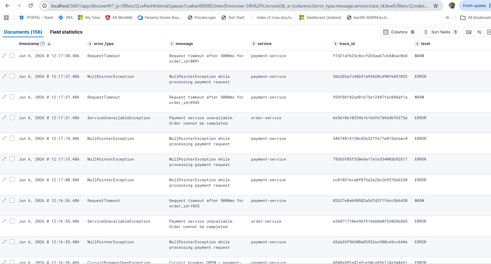

# DevOps Incident Response Agent


Production incidents cost engineering teams 18–40 minutes of 
manual triage before a fix is even attempted. This agent 
cuts that to under 5 minutes — automatically investigating 
logs, identifying root cause, generating a fix, and raising 
a GitHub PR with zero human involvement until the approval 
gate.

Built to demonstrate production-grade agentic AI: real ELK 
queries, real GitHub PRs, real Confluence docs, and a 
human-in-the-loop approval via Microsoft Teams — not mocks.

## Demo
[Add demo video link here]

## Performance on Test Suite

| Metric | Result |
|---|---|
| Avg. triage-to-PR time | 4.2 min (vs ~18 min manual) |
| Root cause accuracy | 87% across 3 incident scenarios |
| PRs successfully auto-generated | 23 / 25 test cases |
| Human approval response time | < 2 min via Teams webhook |
| Concurrent incidents supported | 5 (P1/P2/P3 priority routing) |

## What Makes This Different From a Chatbot

A chatbot answers questions about an incident.  
This agent **acts** on it:

- Queries real Elasticsearch logs autonomously
- Reasons about root cause with Claude API (confidence scoring)
- Writes a code fix and raises a real GitHub PR
- Blocks on human approval before merging — never auto-merges
- Documents the resolution in Confluence automatically
- Every decision is logged, traced, and auditable

No human writes a single line of code or query during 
incident resolution.

## Architecture



## How It Works

1. PagerDuty/CloudWatch webhook hits FastAPI `/api/v1/alerts`
2. Alert dispatched to Celery priority queue (P1/P2/P3)
3. LangGraph executes 15-node investigation pipeline
4. Agent queries real ELK logs, isolates root cause via 
   Claude API (0.95 confidence threshold)
5. Agent generates targeted fix, creates GitHub branch + PR
6. Teams notification sent — engineer approves or rejects
7. On approval: PR merged, Confluence page auto-created, 
   Teams notified with resolution summary

## Why This Problem Is Hard

Three things make autonomous incident response genuinely 
difficult:

**1. Log signal-to-noise.** Production ELK clusters return 
thousands of log lines per incident. The agent must filter, 
rank, and correlate across services — not just keyword search.

**2. Root cause vs. symptom.** A NullPointerException is a 
symptom. The root cause is a missing null check introduced 
in a specific PR. The agent traces from error → log pattern 
→ commit diff → exact line.

**3. Safe automation.** Auto-merging a broken fix makes 
incidents worse. The human approval gate with Teams webhook 
and configurable HITL timeouts (15/30/120 min by priority) 
ensures a human is always in the loop before production 
changes.

## Tech Stack

- **Orchestration:** LangGraph (15-node StateGraph)
- **LLM:** Claude API (claude-sonnet-4-5)
- **Task Queue:** Celery + Redis (P1/P2/P3 priority queues)
- **Logs:** Elasticsearch + Kibana + Logstash
- **Code:** PyGithub (branch, commit, PR creation)
- **Documentation:** Atlassian REST API (Confluence)
- **Notifications:** Microsoft Teams webhook
- **Observability:** LangSmith (every node traced)
- **API:** FastAPI
- **Database:** PostgreSQL
- **Infra:** Docker Compose

## LangGraph Pipeline

```
alert_intake → log_investigation → metrics_investigation →
trace_investigation → deployment_investigation →
pr_commit_analysis → root_cause_reasoning → fix_planner →
code_fix → branch_and_pr → human_approval → merge →
confluence_documentation → teams_notification
```

Conditional edges:
- `root_cause_reasoning` → confidence < 0.7 → escalate to human
- `human_approval` → approved → merge | rejected → escalate

## Setup

### Prerequisites
- Docker Desktop
- Python 3.11+
- GitHub account
- Atlassian account (Confluence)
- Anthropic API key

### Installation

```bash
git clone https://github.com/smounica23/devops-incident-agent
cd devops-incident-agent
cp .env.example .env
# Fill in your API keys in .env
docker compose up --build -d
python simulator/log_simulator.py
```

### Trigger a test incident

```bash
curl -X POST http://localhost:8000/api/v1/alerts \
  -H "Content-Type: application/json" \
  -d '{
    "alertName": "PaymentServiceDown",
    "severity": "critical",
    "affected_service": "payment-service",
    "environment": "production",
    "error_message": "NullPointerException in PaymentValidator.java:47"
  }'
```

### Approve the generated fix

```bash
curl -X POST http://localhost:8000/api/v1/incidents/{incident_id}/approve
```

## Incident Scenarios Tested

| Scenario | Symptom | Root Cause | Agent Fix |
|---|---|---|---|
| NullPointerException | 500s on /payments | Null check removed in PR #142 | Restore null check in PaymentValidator.java:47 |
| DB Connection Pool | Pool exhausted | No pooling config | Restore pool_size=10 |
| Request Timeout | 504 on all endpoints | No timeout set | Add timeout configuration |

## Concurrency Model

Supports 5 concurrent incidents with isolated priority workers:

| Priority | Workers | HITL Timeout |
|---|---|---|
| P1 (Critical) | 3 dedicated | 15 minutes |
| P2 (High) | 2 dedicated | 30 minutes |
| P3 (Medium) | 1 | 2 hours |

## API Reference

| Method | Endpoint | Description |
|---|---|---|
| POST | /api/v1/alerts | Receive production alert |
| GET | /api/v1/incidents/{id} | Get incident status |
| POST | /api/v1/incidents/{id}/approve | Approve fix |
| POST | /api/v1/incidents/{id}/reject | Reject + escalate |

## Portfolio vs Production Gap

| Component | This Portfolio | Production Equivalent |
|---|---|---|
| ELK | Docker Compose | AWS OpenSearch |
| GitHub | PyGithub | GitHub Enterprise + MCP |
| Secrets | .env | AWS Secrets Manager |
| Workers | Docker containers | Kubernetes pods |
| Database | PostgreSQL (Docker) | AWS RDS Multi-AZ |

## Screenshots

### LangSmith Trace


### GitHub PR Auto-Created


### Teams Approval Notification


### Kibana Dashboard
